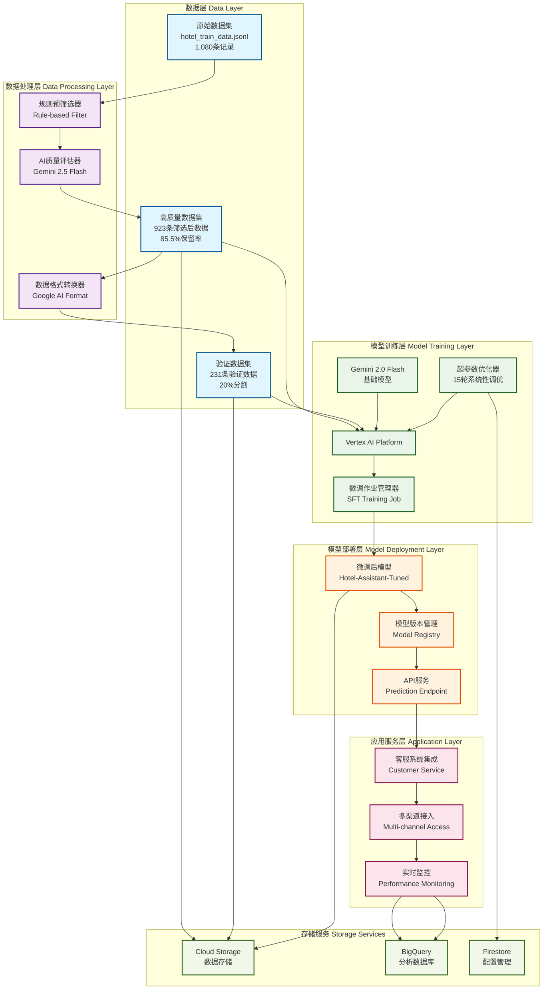
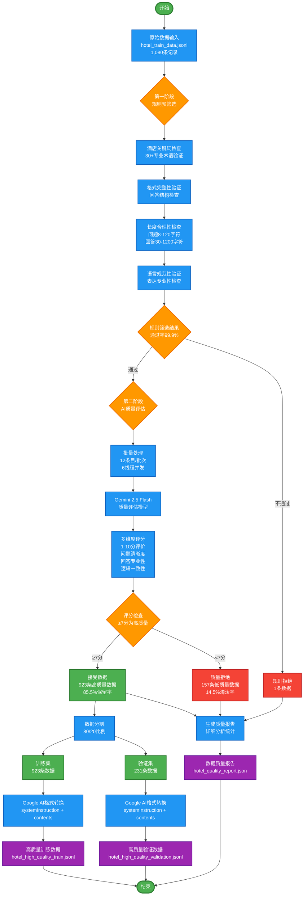
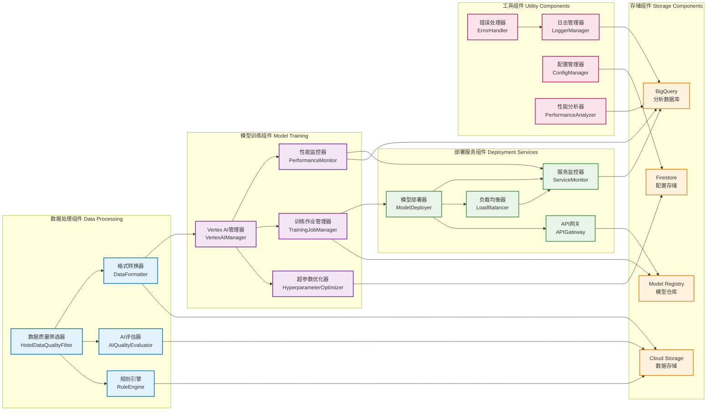
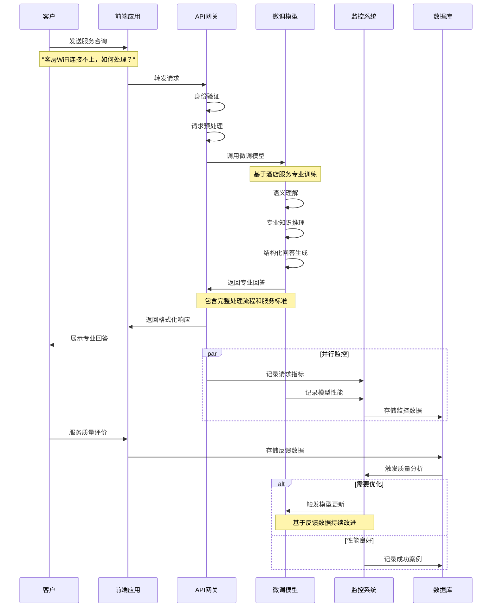

# 酒店AI微调系统架构与流程图

## 📋 文档概述

本文档包含酒店服务AI智能助手微调项目的完整系统架构图和业务流程图，基于Google Cloud Platform的Vertex AI Gemini微调解决方案。

## 🏗️ 系统整体架构图



## 📊 数据质量控制流程图



## 🔄 模型微调训练流程图

```mermaid
flowchart TD
    %% 训练准备
    Start([开始微调训练]) --> DataPrep[数据准备<br/>923条训练数据<br/>231条验证数据]
    DataPrep --> ModelSelect[模型选择<br/>Gemini 2.0 Flash]
    
    %% 超参数配置
    ModelSelect --> HyperConfig[超参数配置<br/>基于15轮优化经验]
    HyperConfig --> Config1[学习率乘数: 0.5<br/>最优稳定配置]
    Config1 --> Config2[训练轮数: 2 Epochs<br/>防过拟合最佳平衡]
    Config2 --> Config3[批次大小: 4<br/>内存效率优化]
    Config3 --> Config4[验证分割: 20%<br/>充分验证覆盖]
    
    %% 训练执行
    Config4 --> TrainJob[创建SFT训练作业<br/>Vertex AI Platform]
    TrainJob --> TrainStart[开始训练<br/>约70分钟预计时长]
    
    %% 训练监控
    TrainStart --> Monitor[实时监控<br/>训练指标追踪]
    Monitor --> Metrics[关键指标<br/>训练损失<br/>验证准确率<br/>收敛状态]
    
    %% 收敛检查
    Metrics --> Convergence{收敛检查<br/>60-80步平台期}
    Convergence -->|继续训练| Monitor
    Convergence -->|收敛完成| TrainComplete[训练完成<br/>验证准确率80.3%]
    
    %% 模型验证
    TrainComplete --> Validation[模型验证<br/>验证集性能评估]
    Validation --> Performance[性能指标<br/>训练准确率: 80.5%<br/>验证准确率: 80.3%<br/>训练损失: <0.6<br/>验证损失: <0.6]
    
    %% 过拟合检查
    Performance --> OverfitCheck{过拟合检查<br/>训练/验证指标一致性}
    OverfitCheck -->|存在过拟合| Retrain[重新训练<br/>调整超参数]
    OverfitCheck -->|无过拟合| ModelReady[模型就绪<br/>Hotel-Assistant-Tuned]
    
    %% 模型部署
    ModelReady --> Deploy[模型部署<br/>创建预测端点]
    Deploy --> Endpoint[API端点<br/>生产环境就绪]
    
    %% 性能测试
    Endpoint --> Testing[性能测试<br/>响应时间<br/>并发能力<br/>准确率验证]
    Testing --> TestResult{测试结果评估}
    TestResult -->|不达标| Optimize[性能优化<br/>调整部署配置]
    TestResult -->|达标| Production[生产上线<br/>正式服务]
    
    %% 监控反馈
    Production --> Monitor2[生产监控<br/>实时性能跟踪]
    Monitor2 --> Feedback[用户反馈<br/>服务质量评估]
    Feedback --> Improve[持续改进<br/>模型迭代优化]
    
    %% 重新训练循环
    Retrain --> Config1
    Optimize --> Deploy
    Improve --> DataPrep
    
    Production --> End([微调完成])
    
    %% 样式定义
    classDef startEnd fill:#4caf50,stroke:#2e7d32,stroke-width:3px,color:#fff
    classDef process fill:#2196f3,stroke:#1565c0,stroke-width:2px,color:#fff
    classDef config fill:#9c27b0,stroke:#6a1b9a,stroke-width:2px,color:#fff
    classDef decision fill:#ff9800,stroke:#ef6c00,stroke-width:2px,color:#fff
    classDef important fill:#f44336,stroke:#c62828,stroke-width:2px,color:#fff
    classDef success fill:#4caf50,stroke:#2e7d32,stroke-width:2px,color:#fff
    
    class Start,End startEnd
    class DataPrep,ModelSelect,TrainJob,TrainStart,Monitor,Validation,Deploy,Endpoint,Testing,Monitor2,Feedback process
    class HyperConfig,Config1,Config2,Config3,Config4 config
    class Convergence,OverfitCheck,TestResult decision
    class Retrain,Optimize,Improve important
    class TrainComplete,Performance,ModelReady,Production success
```



## 🔧 技术组件架构图



## 📱 业务应用流程图



```

## 📋 图表说明

### 系统整体架构图
- **数据层**：展示从原始数据到高质量数据的处理过程
- **数据处理层**：包含规则筛选和AI评估的双重质量控制
- **模型训练层**：基于Vertex AI的完整训练流程
- **模型部署层**：从模型到API服务的部署架构
- **应用服务层**：面向客户的服务接入和监控
- **存储服务**：支撑整个系统的存储架构

### 数据质量控制流程图
- **两阶段筛选**：规则预筛选（99.9%通过率）+ AI质量评估（85.5%保留率）
- **多维度评估**：问题清晰度、回答专业性、逻辑一致性
- **质量保证**：从1,080条原始数据筛选出923条高质量训练数据

### 模型微调训练流程图
- **系统性优化**：基于15轮实验的最优配置
- **防过拟合策略**：调整Epochs ，降低学习率等
- **实时监控**：训练过程的关键指标追踪
- **持续改进**：生产环境反馈的闭环优化

### 技术组件架构图
- **模块化设计**：5大组件分类，职责清晰
- **松耦合架构**：组件间通过标准接口交互
- **可扩展性**：支持水平扩展和功能扩展
- **高可用性**：关键组件的冗余和容错设计

### 业务应用流程图
- **端到端流程**：从客户请求到专业回答的完整链路
- **并行处理**：监控和业务逻辑的并行执行
- **质量反馈**：用户评价驱动的持续优化
- **实时监控**：全链路的性能和质量监控


---
*文档基于真实微调项目架构*  
*图表使用Mermaid语法，支持在线渲染*  
*最后更新：近期* 